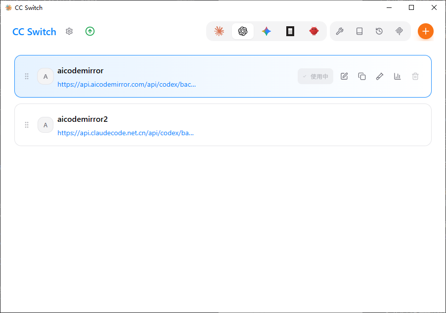
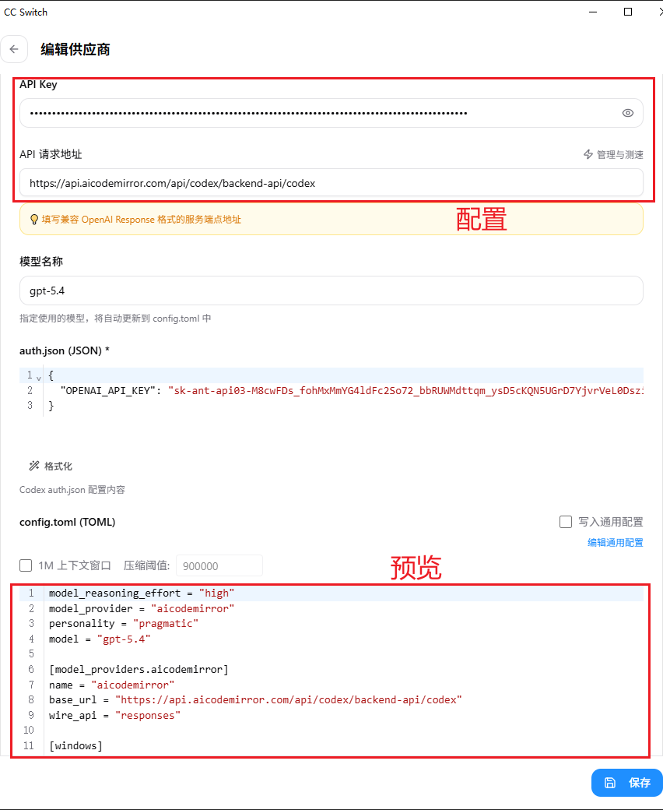

# 命令行管理器工具架构方案（PyQt）

## 1. 目标与范围

本工具是一个桌面端命令行管理器，使用 PyQt 构建界面，支持以下核心能力：

1. 类似 CC 风格的卡片化管理界面。
2. 动态配置命令模板，模板由“固定片段 + 可变参数片段”组成。
3. 通过多 Tab 对命令分类，分类可动态新增、编辑、删除。
4. 点击运行后在新命令行窗口执行最终命令。
5. 所有分类和命令模板可持久化保存到 JSON。

## 2. 功能需求映射

### 2.1 界面风格（需求 1）

参考CC-Switch风格。
- 所有 QLabel 等文本控件保持透明背景，不允许出现独立灰底条，文本背景应与所属容器背景一致。

布局参考：
- 顶部：应用标题、全局操作按钮（新增分类、导入/导出、设置）。
- 中部：Tab 分类栏。
- 主区：命令卡片列表（每张卡片包含命令名称、运行按钮、编辑按钮）。

以上三点为主区界面，参考

- 其他：命令编辑界面。参考


### 2.2 动态参数模型（需求 2）

- 命令模板由多个片段 Segment 按顺序组成。
- Segment 支持两类：
  - literal：固定文本（例如 echo）。
  - variable：运行前由用户输入的变量（例如 hello）。
- 示例：echo hello
  - Segment[0] = literal("echo")
  - Segment[1] = variable(key="message", default="hello")

### 2.3 多 Tab 分类（需求 3）

- Tab 对应 Category。
- 每个 Category 下有多个命令条目。
- 支持动态新增/重命名/删除 Category。

### 2.4 运行命令（需求 4）

- 点击“运行”后：
  1. 生成最终命令字符串。
  2. 调用系统终端打开新窗口并执行。

### 2.5 JSON 持久化（需求 5）

- 启动时从 JSON 加载。
- 编辑后手动保存按钮覆盖原来的json的字段。

## 3. 分层架构

建议采用 4 层结构，便于维护和扩展：

1. UI 层（PyQt Widgets）
2. 应用服务层（用例编排、状态同步）
3. 领域模型层（Category / CommandTemplate / Segment）
4. 基础设施层（JSON 仓储、终端启动器）

### 3.1 UI 层

职责：展示、交互，一个mainWindow，附带多个widget设计，不包含dialog。

核心组件：

- MainWindow：主窗口，承载 Tab 与命令卡片列表。
- CategoryWidget：分类管理(tab形式)，各个分类下可以包含多个命令卡片，可新增、删除、重命名。
- CommandCardWidget：命令卡片，可点击卡片条目后面的运行、删除按钮，点击编辑进入CommandEditorWidget子界面。
- CommandEditorWidget：命令编辑widget（片段增删、顺序调整），命令有多个Segment条目，点击退出按钮可以返回CommandCardWidget界面，上方配置，下方可进行命令预览。整个命令编辑页使用单一 ScrollView 作为外层滚动容器，Segment 区域不再使用独立的内层 ScrollView。
- SegmentWidget：区分literal和variable两种不同的显示方式，literal不可改为label，variable可改为lineEdit，用户在里面设置variable。

### 3.2 应用服务层

职责：处理 UI 动作后的业务流程。

核心服务：

- CategoryService：分类新增、删除、重命名
- CommandService：命令编辑、运行、修改、保存、调整顺序

### 3.3 领域模型层

核心对象：

- CategoryModel
  - id(标识Category，即使名字改变了Command也能找到对应的Category，保证唯一)
  - name
  - order(Category的顺序)
- CommandModel
  - id(标识Command，即使名字改变了Command也能找到对应的Category，保证唯一)
  - categoryId(所属的Category Id)
  - name
  - description
  - segments
  - order(Command顺序)
- SegmentModel
  - type: literal | variable
  - value

### 3.4 基础设施层

- JsonBase：读写 commands.json。
- TerminalBase：按平台打开新终端执行命令。

Windows 首选策略：

- cmd：start cmd /k <command>
- 或 PowerShell：start powershell -NoExit -Command <command>

## 4. 推荐目录结构

```text
BatCreator/
  app/
    main.py
    UI/
      styles/
        theme.qss
      MainWindow.py
      widgets/
        CategoryWidget.py
        CommandCardWidget.py
        CommandEditorWidget.py
        SegmentWidget.py
    Services/
      CategoryService.py
      CommandService.py
    Domain/
      CategoryModel.py
      CommandModel.py
      SegmentModel.py
    Base/
      JsonBase.py
      TerminalBase.py
  data/
    commands.json
  Docs/
    cli-generator-architecture.md
```

## 5. JSON 数据结构设计

```json
{
  "categories": [
    {
      "id": "0",
      "name": "TB",
      "order": 0
    }
  ],
  "commands": [
    {
      "id": "0",
      "categoryId": "0",
      "name": "Echo 示例",
      "description": "输出用户输入文本",
      "segments": [
        {
          "type": "literal",
          "value": "echo"
        },
        {
          "type": "variable",
          "value": "hello"
        }
      ]
    }
  ]
}
```

## 6. 核心流程

### 6.1 新增命令模板

1. 用户在某个 Tab 点击“新增命令”。
2. 打开 CommandEditorDialog。
3. 用户逐行添加 Segment（literal/variable）。
4. 写入内存状态并调用JsonBase持久化。

### 6.2 运行命令

1. 用户点击命令卡片“运行”。
2. CommandService 生成命令字符串。
3. TerminalBase 在新终端窗口执行命令。

### 6.3 分类管理

1. 用户新增/重命名/删除分类。
2. CategoryService 更新 Category 列表与排序。
3. 触发 UI Tab 重绘。
4. 保存 JSON。

## 7. 命令渲染与转义策略

为避免拼接错误，推荐流程：

1. 按平台规则做转义并拼接为命令字符串在 UI 显示“预览命令”。

Windows运行重点注意：

- 含空格参数需要加引号。
- 引号内容需要转义。
- 统一由 CommandService 处理，UI 不直接拼接字符串。

## 8. CC 风格 UI 落地建议

- 主背景使用浅灰层次（例如 #f3f4f6 / #e5e7eb）。
- 卡片使用圆角 + 细边框 + 悬浮态高亮。
- 主要操作按钮使用单一强调色（如橙色）。
- 字体层级明确：标题、次级信息、链接色。
- 列表项支持拖拽排序（分类与命令均可后续扩展）。
- 文本标签与提示文字统一透明背景，不额外设置灰色底块。
- 命令编辑页采用整页滚动，避免多层滚动区域造成视觉割裂。

## 9. 风险与规避

- 风险：命令拼接转义不正确。
  - 考虑字符串可能有空格的情况，运行可能有错误。
- 风险：删除分类json删除不彻底。
  - 删除分类更新json要把属于这个分类的命令的json也删除。
- 风险：json字段覆盖异常。
  - CommandService修改保存，覆盖对应的json字段。


## 10. 代码风格

核心：无下划线，仅用大 / 小驼峰
类 / 常量：大驼峰；函数 / 变量：小驼峰
格式极简统一，兼顾可读性与开发效率

1. 命名总规则
- 禁止使用**下划线**（`_`）作为命名分隔符
- 仅允许两种命名格式：
  - **小驼峰**：首字母小写，后续单词首字母大写（`userInfo`、`getUserList`）
  - **大驼峰**：所有单词首字母大写（`UserController`、`OrderService`）

1. 类命名：大驼峰
- 所有**类、枚举、异常类**统一使用**大驼峰**
- 示例：
```python
class UserManager:
    pass

class DataParseException(Exception):
    pass
```

3. 函数/方法命名：小驼峰
- 所有**函数、类方法、静态方法**统一使用**小驼峰**
- 示例：
```python
def getUserInfo():
    pass

class OrderService:
    def createOrder(self):
        pass
```

4. 变量命名：小驼峰
- 普通变量、局部变量、成员变量、参数统一使用**小驼峰**
- 禁止单字符无意义命名（循环索引`i/j/k`除外）
- 示例：
```python
userName = "张三"
orderList = []
totalPrice = 99.0
```

5. 常量命名：大驼峰
- 全局常量、配置项统一使用**大驼峰**
- 示例：
```python
MaxRetryCount = 3
DefaultPageSize = 10
ApiBaseUrl = "https://api.example.com"
```

6. 缩进与空格
- 统一使用 **4 个空格**缩进，禁止使用 Tab
- 运算符两侧、逗号后加 1 个空格
- 示例：
```python
total = price + count
userList = [1, 2, 3]
```

7. 代码换行
- 一行代码不超过 120 字符
- 函数参数、长表达式换行后对齐
- 示例：
```python
def createUser(userName, userAge, userEmail, 
               userAddress, userPhone):
    pass
```

8. 注释规范
- 函数/类必须写**文档字符串**（三双引号）
- 关键逻辑单行注释，禁止无意义注释
- 示例：
```python
def getUserInfo(userId):
    """根据用户ID查询用户详情"""
    # 查询用户基础信息
    return userData
```

9. 导入规范
- 标准库 → 第三方库 → 本地模块，分组导入
- 禁止通配符导入（`from xxx import *`）
- 示例：
```python
import json
import requests
from userService import UserManager
```

10. 格式与简洁性
- 文件末尾保留 1 个空行
- 函数之间空 2 行，类内方法之间空 1 行
- 禁止冗余代码、未使用的变量/导入

## 11. 验收标准

1. 可创建至少 3 个 Tab 分类。
2. 每个分类可新增命令并保存。
3. 命令模板可同时包含固定片段与变量片段。
4. 点击运行可在新终端窗口执行并看到结果。
5. 重启应用后 JSON 数据完整恢复。
